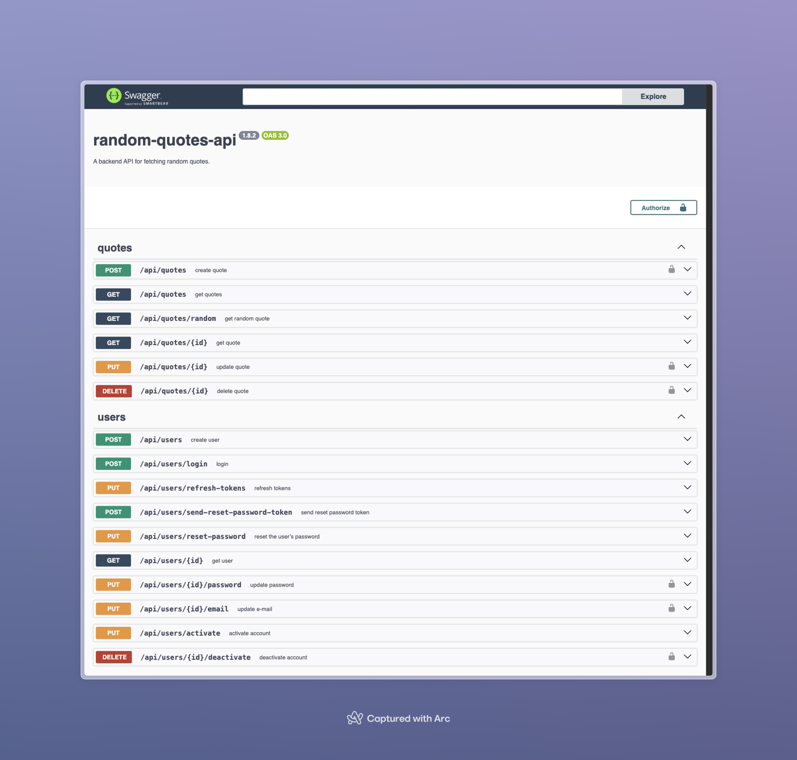

## Random Quotes API [](https://github.com/otegecmis/random-quotes-api/blob/main/LICENSE.md)

- A backend API built with **Node.js**, **MongoDB**, **Express.js** and **TypeScript** for fetching random quotes.

### 1. Installation

- **Clone the repository**

```sh
git clone https://github.com/otegecmis/random-quotes-api.git && cd random-quotes-api
```

- **Generate `.env`**

```sh
npm run env
```

Update the generated `.env` file as needed and review the `.env.example` file for more options.

- **Start the project**

| Action                                 | Command                             |
| -------------------------------------- | ----------------------------------- |
| Start in Development Mode              | `npm run dev`                       |
| Build and Start for Production         | `npm run build && npm run start`    |
| Start with Docker                      | `npm run docker`                    |

That's it! 🥳

### 2. Documentation

#### Swagger

To access `Swagger` documentation, make sure the `NODE_ENV` in the `.env` file is set to `development`.

Then, you can access it via `api/swagger`.

<div style="float: left;">
    
</div>


